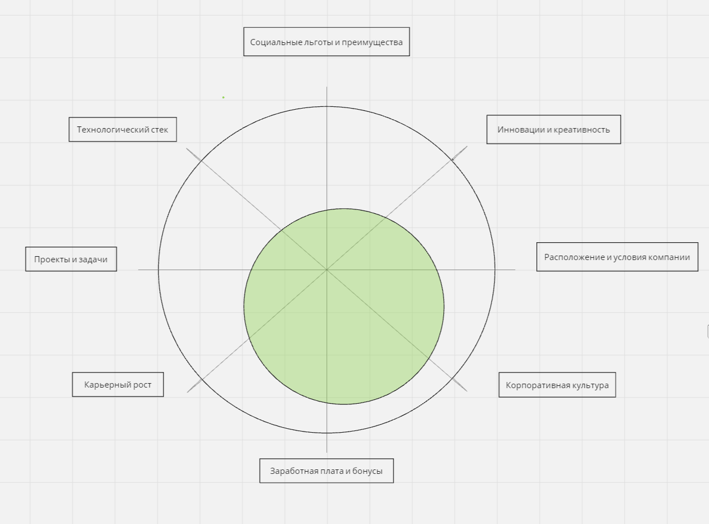
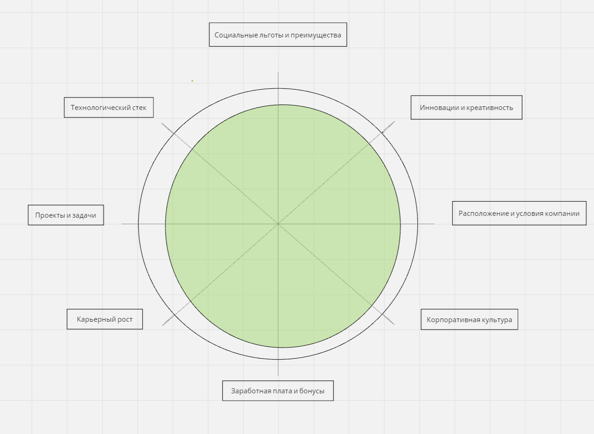

1. Карьерный рост 6/10
2. Заработная плата и бонусы 8/10
3. Корпоративная культура 8/10
4. Расположение и условия компании 7/10
5. Инновации и креативность 4/10
6. Социальные льготы и преимущества 4/10
7. Технологический стек 4/10
8. Проекты и задачи 4/10

1. Карьерный рост 9/10

- Возможность двигаться по карьерной лестнице.

2. Заработная плата и бонусы 9/10

- Конкурентоспособная заработная плата.
- Бонусы, премии и другие финансовые стимулы.

3. Корпоративная культура 9/10

- Дружелюбная и поддерживающая рабочая среда.
- Ценности и миссия компании.
- Отношения в коллективе.

4. Расположение и условия компании 9/10

- Гибкий график работы.
- Возможность удаленной работы.
- Удобное местоположение офиса.
- Современные и комфортные условия работы.

5. Инновации и креативность 9/10

- Возможность участвовать в инновационных проектах.
- Поддержка креативных идей и инициатив.

6. Социальные льготы и преимущества 9/10

- Медицинская страховка.
- Дополнительные льготы (например, фитнес-зал, корпоративные мероприятия).

7. Технологический стек 8/10

- Современные и интересные технологии.
- Возможность работать с новыми инструментами и языками программирования.

8. Проекты и задачи 8/10

- Интересные и сложные проекты.
- Возможность решать значимые и вызывающие задачи.
