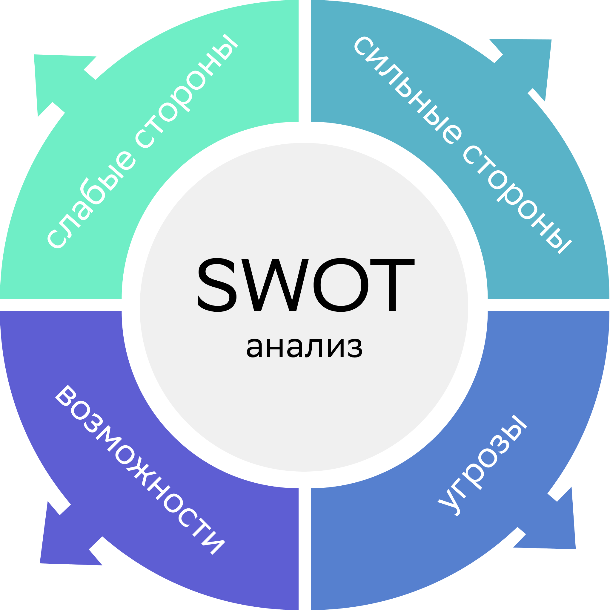

## Анализ навыков

#### Сильные стороны (Strengths):

1. Коммуникабельность.
2. Стрессоустойчивость.
3. Много друзей и знакомых в различных сферах.
4. Неоконченное высшее в инженерной отрасли.
5. Опыт работы на фрилансе.
6. Легко обучаюсь новому, не зависимо от того, что за отрасль.
7. Высокая работоспособность и безумное трудолюбие.

#### Слабые стороны (Weaknesses):

1. Плохая концентрация внимания.

#### Возможности (Opportunities):

1. Бурный рост и трансформация сфеты IT. Технологические инновации, такие как искусственный интеллект, машинное обучение, блокчейн и облачные вычисления, активно внедряются в различные отрасли. Это создает огромные возможности для профессионалов, стремящихся к карьерному росту и развитию. Для меня это представляет преимущество в виде постоянного обновления знаний и навыков, а также возможности участвовать в передовых проектах, которые формируют будущее технологий.
2. AI и ML ускоряют мое обучение.
3. В индустрии IT наблюдаются несколько ключевых изменений и закономерностей. Во-первых, увеличивается спрос на специалистов с навыками в области кибербезопасности, что связано с ростом кибератак и необходимостью защиты данных. Во-вторых, удаленная работа становится нормой, что открывает возможности для глобального сотрудничества и привлечения талантов из разных уголков мира. В-третьих, увеличивается внимание к устойчивому развитию и экологическим аспектам технологий, что стимулирует разработку "зеленых" решений. Эти изменения помогут мне адаптироваться к новым требованиям рынка и предложить востребованные решения, которые соответствуют современным тенденциям.
4. Из неудачного опыта других людей, работающих в сфере IT, можно выделить несколько ключевых ошибок. Во-первых, недооценка важности непрерывного обучения и развития навыков. Технологии быстро меняются, и отставание от трендов может привести к утрате конкурентоспособности. Во-вторых, недостаточное внимание к кибербезопасности и защите данных. Утечки данных и кибератаки могут нанести серьезный ущерб репутации компании и привести к финансовым потерям. В-третьих, игнорирование важности командной работы и коммуникации. Эффективное взаимодействие в команде и четкая коммуникация являются ключевыми факторами успеха в любом проекте.

#### Угрозы (Threats):

1. В данный момент в России наблюдается IT-бум. Все хотят быть программистами из-за высоких зарплат и социальных привилегий. Это создает высокую конкуренцию на рынке труда.
